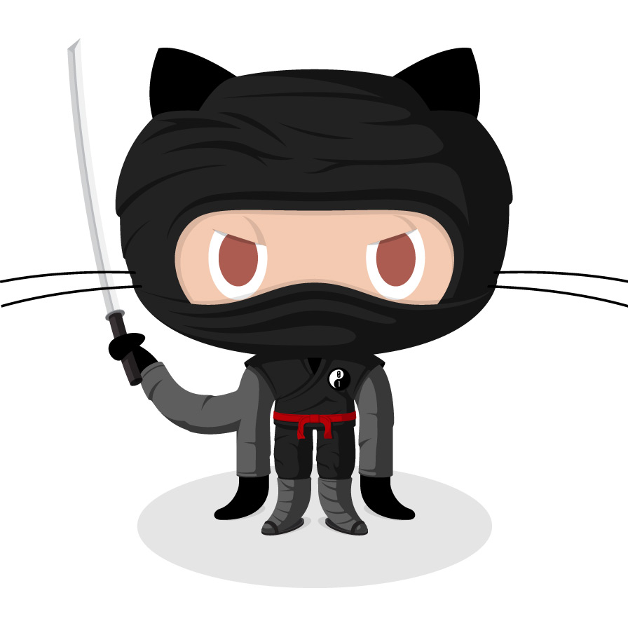

# Introduction to github with R

## Lecture

```{r, out.width = "50%", echo = FALSE, fig.align = "center", fig.cap = "Dream pet dragon"}
knitr::include_graphics("images/fun_dragon.jpg")
```

## Practical

### Context

We will configure Rstudio to work with our github account, then create a new project and start using `github`. To have some data I suggest to use the awesome `palmerpenguins` dataset `r emo::ji("penguin")`.

### Information of the data
These data have been collected and shared by [Dr. Kristen Gorman](https://www.uaf.edu/cfos/people/faculty/detail/kristen-gorman.php) and [Palmer Station, Antarctica LTER](https://pal.lternet.edu/).

The package was built by Drs Allison Horst and Alison Hill, check out the [official website](https://allisonhorst.github.io/palmerpenguins/).

The package `palmerpenguins` has two datasets.

```{r showdata}
library(palmerpenguins)
```

The dataset `penguins` is a simplified version of the raw data; see `?penguins` for more info:

```{r example-penguins}
head(penguins)
```

The other dataset `penguins_raw` has the raw data; see `?penguins_raw` for more info:

```{r example-penguins-raw}
head(penguins_raw)
```


For this exercise, we're gonna use the `penguins` dataset.

### Questions

**1)** Create a github account if not done yet.

**2)** Configure Rstudio with your github account using the `usethis` package.

```{r, eval = FALSE, class.source = "exer"}
usethis::git_sitrep()
usethis::use_git_config(
  user.name = "your_username",
  user.email = "your_email@address.com"
)
```

**3)** Create and Store your GITHUB Personal Authorisation Token


```{r, eval = FALSE, class.source = "exer"}
usethis::create_github_token()
credentials::set_github_pat()
```


**4)** Create a new R Markdown project, initialize it for git, and create a new git repository

```{r, eval = FALSE, class.source = "exer"}
#create R project
usethis::use_git()

#restart R
usethis::use_github()
usethis::git_vaccinate()
```

**5)** Create a new Rmarkdown document, in your project. Then save the file and stage it.

**6)** Create a new commit including the new file and push it to github (Check on github that it works).

**7)** Edit the file. Delete everything after line 12. Add a new section title, simple text and text in bold font. Then knit and compile.

**8)** Make a new commit (with a meaningful message), and push to github.

**9)** Create a new branch, and add a new section to the rmarkdown file in this branch. Whatever you want. I would suggest a graph of the data.

**10)** Create a commit and push it to the branch.

**11)** On github, create a pull request to merge the 2 different branches. 

**12)** Check and accept the pull request to merge the 2 branches.

You have successfully used all the essential tools of `git` `r emo::ji("tada")` . You are really to explore `r emo::ji("detective")` and discover its power `r emo::ji("flex")`

```{r, out.width="30%", echo = FALSE, fig.align="center", fig.cap = "Happy git(hub)-ing"}

```
