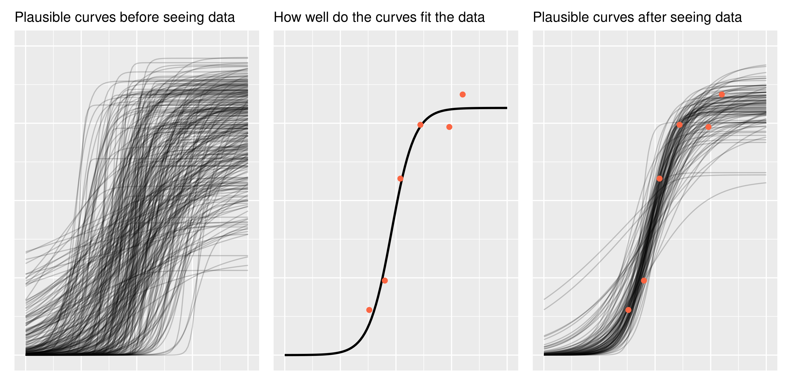

# Introduction to `Bayesian Inference`

## theory


### Bayes' theorem

First, let's review the theorem. Mathematically, it says how to convert one conditional probability into another one.

$$ P(B \mid A) = \frac{ P(A \mid B) * P(B)}{P(A)} $$

The formula becomes more interesting in the context of statistical modeling. We
have some model that describes a data-generating process and we have some
*observed* data, but we want to estimate some *unknown* model parameters. 
In that case, the formula reads like:

$$ P(\text{hypothesis} \mid \text{data}) = \frac{ P(\text{data} \mid \text{hypothesis}) * P(\text{hypothesis})}{P(\text{data})} $$

These terms have conventional names:

$$ \text{posterior} = \frac{ \text{likelihood} * \text{prior}}{\text{evidence}} $$

*Prior* and *posterior* describe when information is obtained: what we know pre-data is our
prior information, and what we learn post-data is the updated information
("posterior"). 

The *likelihood* in the equation says how likely the data is given the model
parameters. I think of it as *fit*: How well do the parameters fit the data?
Classical regression's line of best fit is the maximum likelihood line. The
likelihood also encompasses the data-generating process behind the model. For
example, if we assume that the observed data is normally distributed, then we
evaluate the likelihood by using the normal probability density function. You
don't need to know what that last sentence means. What's important is that the
likelihood contains our built-in assumptions about how the data is distributed.

The *evidence* (sometimes called *average likelihood*) is hareder to grasp. I am not sure how to describe it in an intuitive way.
It's there to make sure the math works out so that the posterior probabilities sum to 1.
Some presentations of Bayes' theorem gloss over it and I am not the exception `r emo::ji("smile")`.
The important thing to note is that the posterior is proportional to the
likelihood and prior information.

$$ 
\text{posterior information} \propto 
  \text{likelihood of data} * \text{prior information} 
$$

So simply put, **you update your prior information in proportion to how well it fits
the observed data**. So essentially you are doing that on a daily basis for everything except when you ar doing frequentist stats `r emo::ji("smile")`.


```{r, eval = FALSE, echo= FALSE, fig.width = 10.5, fig.height = 3.5, out.width = "100%", fig.cap = "Bayesian Triptych"}

data <- tibble(
  age = c(38, 45, 52, 61, 80, 74),
  prop = c(0.146, 0.241, 0.571, 0.745, 0.843, 0.738)
)

inv_logit <- function(x) 1 / (1 + exp(-x))

model_formula <- bf(
  # Logistic curve
  prop ~ inv_logit(asymlogit) * inv(1 + exp((mid - age) * exp(scale))),
  # Each term in the logistic equation gets a linear model
  asymlogit ~ 1,
  mid ~ 1,
  scale ~ 1,
  # Precision
  phi ~ 1,
  # This is a nonlinear Beta regression model
  nl = TRUE,
  family = Beta(link = identity)
)

prior_fixef <- c(
  # Point of steepest growth is age 4 plus/minus 2 years
  prior(normal(48, 12), nlpar = "mid", coef = "Intercept"),
  prior(normal(1.25, .75), nlpar = "asymlogit", coef = "Intercept"),
  prior(normal(-2, 1), nlpar = "scale", coef = "Intercept")
)

prior_phi <- c(
  prior(normal(2, 1), dpar = "phi", class = "Intercept")
)

fit_prior <- brm(
  model_formula,
  data = data,
  prior = c(prior_fixef, prior_phi),
  iter = 2000,
  chains = 4,
  sample_prior = "only",
  cores = 1,
  control = list(adapt_delta = 0.9, max_treedepth = 15)
)
draws_prior <- data %>%
  tidyr::expand(age = 0:100) %>%
  tidybayes::add_fitted_draws(fit_prior, n = 300)

p1 <- ggplot(draws_prior) +
  aes(x = age, y = .value) +
  geom_line(aes(group = .draw), alpha = .2) +
  theme(
    axis.ticks = element_blank(),
    axis.text = element_blank(),
    axis.title = element_blank()
  ) +
  expand_limits(y = 0:1) +
  ggtitle("Plausible curves before seeing data")

fm1 <- nls(prop ~ SSlogis(age, Asym, xmid, scal), data)
new_data <- tibble(age = 0:100) %>%
  mutate(
    fit = predict(fm1, newdata = .)
  )

point_orange <- "#FB6542"

p2 <- ggplot(data) +
  aes(x = age, y = prop) +
  geom_line(aes(y = fit), data = new_data, size = 1) +
  geom_point(color = point_orange, size = 2) +
  theme(
    axis.ticks = element_blank(),
    axis.text = element_blank(),
    axis.title = element_blank()
  ) +
  expand_limits(y = 0:1) +
  expand_limits(x = c(0, 100)) +
  ggtitle("How well do the curves fit the data")

fit <- brm(
  model_formula,
  data = data,
  prior = c(prior_fixef, prior_phi),
  iter = 2000,
  chains = 4,
  cores = 1,
  control = list(adapt_delta = 0.9, max_treedepth = 15)
)

draws_posterior <- data %>%
  tidyr::expand(age = 0:100) %>%
  tidybayes::add_fitted_draws(fit, n = 100)

p3 <- ggplot(draws_posterior) +
  aes(x = age, y = .value) +
  geom_line(aes(group = .draw), alpha = .2) +
  geom_point(
    aes(y = prop),
    color = point_orange, size = 2,
    data = data
  ) +
  theme(
    axis.ticks = element_blank(),
    axis.text = element_blank(),
    axis.title = element_blank()
  ) +
  expand_limits(y = 0:1) +
  ggtitle("Plausible curves after seeing data")

p1 + p2 + p3
ggsave("bayestriptic.png", width = 10.4, height = 5.1)
```

```{r, out.width = "100%", echo = FALSE, fig.align = "center", fig.cap = "Bayesian Triptych"}

```

```{block2, type="rmdwarning"}
**A word of encouragement!** The prior is an intimidating part of Bayesian
statistics. It seems highly subjective, as though we are pulling numbers from
thin air, and it can be overwhelming for complex models. But if we are familiar
with the kind of data we are modeling, we have prior information. We can have
the model simulate new observations using the prior distribution and then
plot the hypothetical data. Does anything look wrong or implausible about the
simulated data? If so, then we have some prior information that we can include
in our model. Note that we do not evaluate the plausibility of the simulated
data based on the data we have in hand (the data we want to model); that's not 
prior information. 
```


### Bayesian box


## Practical

In this practical, we will revisit our analysis on unicorn aggressivity.
Honestly, we can use any other data with repeated measures for this exercise
but I just love unicorns `r emo::ji("heart")`.
However, instead of fittng the model using `lmer()` from the `lmerTest` 
`r emo::ji("package")` [@R-lmerTest], we will refit the model using 2 excellent 
softwares fitting models with a Bayesian approach: `MCMCglmm` [@MCMCglmm2010] and
`brms` [@R-brms].


### R packages needed

First we load required libraries
```{r loadlibs_bayes, message=FALSE, results='hide', warning=FALSE}

library(lmerTest)
library(tidyverse)
library(rptR)
library(brms)
library(MCMCglmm)
```

### A refresher on unicorn ecology

The last model on unicorns was:

```r
aggression ~ opp_size + scale(body_size, center = TRUE, scale = TRUE)
              + scale(assay_rep, scale = FALSE) + block
              + (1 | ID)
```

Those scaled terms are abit a sore for my eyes and way too long if we need to type them multiple times in this practical.
So first let's recode them.
- 
```{r}
unicorns <- read.csv("data/unicorns_aggression.csv")
unicorns <- unicorns %>%
  mutate(
    body_size_sc = scale(body_size),
    assay_rep_sc = scale(assay_rep, scale = FALSE)
  )
```

Ok now we can fit the same model by just using:

```r
aggression ~ opp_size + body_size_sc + assay_rep_sc + block
              + (1 | ID)
```

We can now fit a model using `lmer()`. Since we want to compare a bit `REML` and `Bayesian` aproaches, I am going to wrap the model function in a function called `system.time()`.
This function simply estimate the `user` and `computer` time use by the function.

```{r}
mer_time <- system.time(
  m_mer <- lmer(
    aggression ~ opp_size + body_size_sc + assay_rep_sc + block
                + (1 | ID),
    data = unicorns)
)
mer_time
summary(m_mer)

```

Ok so it took no time at all to do it and we got our "classic" results.

### MCMCglmm

What makes `MCMCglmm` so useful and powerful `r emo::ji("muscle")` in ecology and for *practical Bayesian people* is that:

1. it is blazing fast `r emo::ji("fast")` (for Bayesian analysis)
2. it is fairly intuitive to code

**but** it also has some inconvenients:

1. it is blazing fast for **Bayesian analysis** meaning `r emo::ji("snail")` it is super slow compared to *maximum likelihood* approaches
2. it has some limitations in terms of functionality, distribution availability and model specifications compared to other *Bayesian* softwares
3. the priors, *oh, the priors* `r emo::ji("loudly_crying_face")`, are a bit tricky to code, handle `r emo::ji("exploding_head")`.


#### Fitting the Model

So here is how we can code the model in `MCMCglmm()`. It is fairly similar to `lmer()` except that the random effects are specified in a different *argument*.

```{r, cache = TRUE}
mcglm_time <- system.time(
  m_mcmcglmm <- MCMCglmm(
    aggression ~ opp_size + body_size_sc + assay_rep_sc + block,
                random = ~ ID,
    data = unicorns)
)
summary(m_mcmcglmm)
mcglm_time
```

Model is slow and not good. We need more iteration and maybe even a longer burnin, and honestly maybe better priors.

```{r}
plot(m_mcmcglmm$Sol)
plot(m_mcmcglmm$VCV)
autocorr.diag(m_mcmcglmm$VCV)
```

Talk about autocorrelation, mixing, convergence and priors here
```{r, cache = TRUE}
n_samp <- 1000
thin <- 500
burnin <- 20000
mcglm_time <- system.time(
  m_mcmcglmm <- MCMCglmm(
    aggression ~ opp_size + body_size_sc + assay_rep_sc + block,
                random = ~ ID,
    data = unicorns,
    nitt = n_samp * thin + burnin, thin = thin, burnin = burnin,
    verbose = FALSE,
    prior = list(
      R = list(V = 1, nu = 0.002),
      G = list(
        G1 = list(V = 1, nu = 0.002)
      )
    )
  )
)
summary(m_mcmcglmm)
mcglm_time
```

```{r}
plot(m_mcmcglmm$Sol)
plot(m_mcmcglmm$VCV)
autocorr.diag(m_mcmcglmm$VCV)
```

### Inferences

#### Fixed effects

Easy peazy lemon squeezy just have a look at the posteriro distribution, does it overlap 0 yes or no.

#### Random effects

Quite a bit more harder. because constrained to be positive

- Interpreting posterior distribution
- using DIC

### brms

**brms** is an acronym for *Bayesian Regression Models using 'Stan'* [@R-brms]. It is a package developed to fit regression models with a Bayesian approach using the amazing `stan` software [@stan2021]. 

What makes `brms` so useful and powerful `r emo::ji("muscle")` in ecology is that:

1. it is really intuitive to code (same syntax as `glmer()`)
2. it is incredibly flexible since it is essentially a front end for `stan` via its `rstan` interface [@R-rstan]

**but** with *great powers come great responsability* `r emo::ji("spider")`


```{r, cache = TRUE}
brm_time <- system.time(
  m_brm <- brm(
    aggression ~ opp_size + body_size_sc + assay_rep_sc + block
        + (1 | ID),
    data = unicorns,
    refresh = 0
  )
)
brm_time
summary(m_brm)
```

#### Hunder the hood 
have a look at the `stan` code

```{r}
stancode(m_brm)
```

#### using shiny


```{r, eval = FALSE}
launch_shinystan(m_brm)
```
```{r, out.width = "50%", echo = FALSE, fig.align = "center", fig.cap = "Shinystan interface"}
knitr::include_graphics("images/shinystan.png")
```

### Inferences

#### Fixed effects

Easy peazy lemon squeezy just have a look at the posteriro distribution, does it overlap 0 yes or no.

#### Random effects

Quite a bit more harder. because constrained to be positive

- Interpreting posterior distribution
- using DIC


## Happy Bayesian stats

```{r, out.width = "50%", echo = FALSE, fig.align = "center", fig.cap = "A GLMM character"}
knitr::include_graphics("images/Thorn.png")
```

